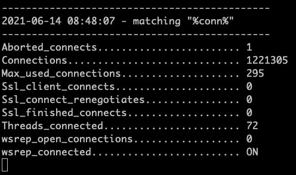

# conny

Show ongoing status for a mysql/mariadb database.

You can filter which status flags to watch

Written in typescript to run on Deno

# Usage

```
Usage: conny [flags]
  -c, --clear         Clear screen before each showing
  -h, --host=name     Connect to host (default 127.0.0.1)
  -u, --user=name     User to connect as (default root)
  -p, --password=name Password to use (default empty)
  -P, --port=#        Port number to use (default 3306)
  -e, --pattern=name  Pattern to match status variables (default %conn%)
```

